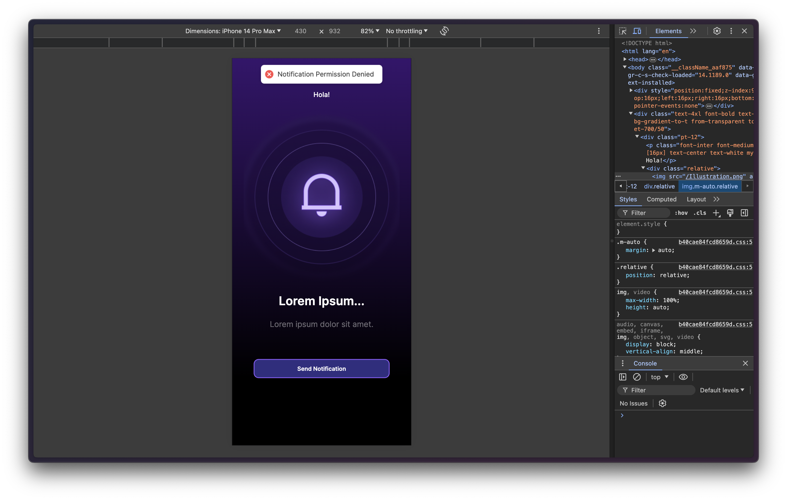
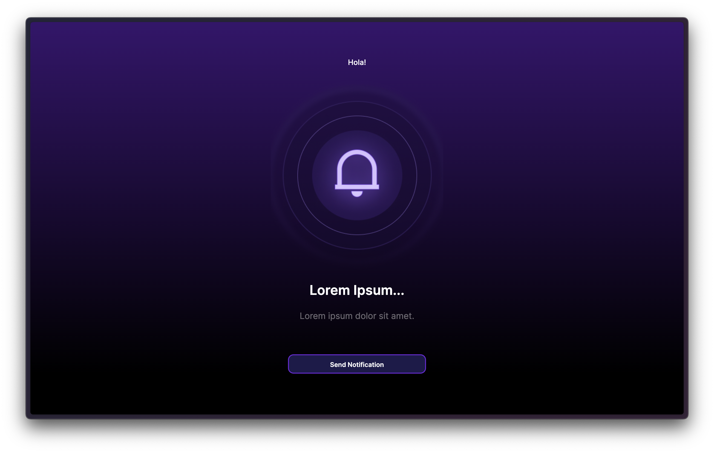

# NotiWave

This web application, built with Next.js, features a sleek front end designed from Figma UI/UX specs and includes PWA support for an enhanced user experience. It also enables users to send notifications with a simple click of the 'Send Notification' button.

## Tech

- Made with [Next.js](https://nextjs.org/) ⚛️
- Written in [TypeScript](https://www.typescriptlang.org/)
- Styled with [TailwindCSS](https://tailwindcss.com/)

## Screenshots

## Configuration and running the Project

### Configuration

- Clone the repository`https://github.com/anuprajvarma/NotiWave.git`
- Navigate to the project directory.

### Running the Project

         Install dependencies using `npm install`
         Start the development server using `npm run dev`
